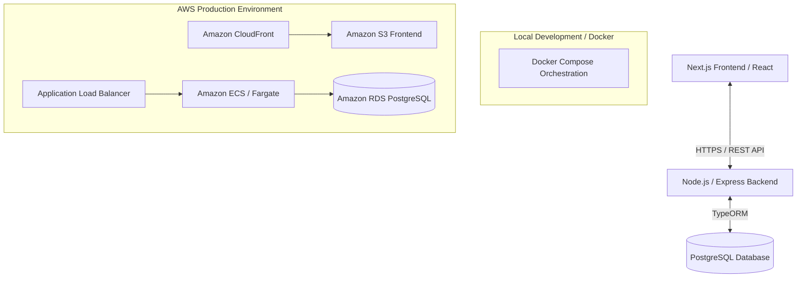

# 💻 Full-Stack Personal Portfolio

> [!IMPORTANT]
> **🚧 Work In Progress (Target Architecture)**
> This repository is in the initial bootstrapping and development phase. The folder structure, AWS cloud infrastructure, and CI/CD pipelines described below represent the **target end-state architecture** of this project. Active features are being built incrementally.

A professional, production-ready, full-stack personal portfolio application designed to showcase software engineering projects, skills, certifications, and professional achievements. 

Built with a modern web architecture, this project features a containerized multi-tier setup, automated infrastructure provisioning, and robust CI/CD pipelines.

---

## 🚀 Key Features

*   **Dynamic Project Showcase**: Interactive projects list and grid views with featured-project highlighting, repository links, and tech-stack badges.
*   **Interactive Skills Matrix**: A visual breakdown of technical competencies, categories, and proficiency levels with progress indicators.
*   **Verified Certifications & Credentials**: Display and manage professional certifications with issuer, date, and verification links.
*   **Admin Dashboard**: Protected administration panel to create, update, and delete projects, skills, and certifications via the REST API.
*   **Dual-Mode Interface**: A unique CLI terminal mode and a graphical dashboard mode — switch between them with the `gui` command.
*   **Offline Fallback**: Automatically loads static cached data when the backend API is unreachable, ensuring the portfolio always renders.
*   **Terminal / CRT Aesthetic**: Dark terminal-inspired UI built with Tailwind CSS, framer-motion animations, and lucide-react icons.
*   **Containerized & Cloud Native**: Fully Dockerized multi-service stack (frontend, backend, PostgreSQL) with Nginx reverse proxy for production.

---

## 🛠️ Tech Stack & Architecture

### High-Level Architecture



### Technology Breakdown

*   **Frontend**: 
    *   [](https://nextjs.org/)
    *   [](https://reactjs.org/)
    *   [](https://www.typescriptlang.org/)
    *   [](https://tailwindcss.com/)
    *   [](https://www.framer.com/motion/)
    *   [](https://lucide.dev/)
*   **Backend**:
    *   [](https://nodejs.org/)
    *   [](https://expressjs.com/)
    *   [](https://typeorm.io/)
    *   [](https://www.postgresql.org/)
    *   [](https://helmetjs.github.io/)
*   **Testing**:
    *   [](https://jestjs.io/)
    *   [](https://testing-library.com/)
*   **DevOps & Infrastructure**:
    *   [](https://aws.amazon.com/)
    *   [](https://www.terraform.io/)
    *   [](https://www.docker.com/)
    *   [](https://www.nginx.com/)
    *   [](https://github.com/features/actions)

---

## 📂 Project Structure

```text
portfolio/
├── LICENSE
├── README.md
├── docker-compose.yml        # Local multi-container orchestration
├── backend/                  # REST API server (Express + TypeORM)
│   ├── .dockerignore
│   ├── .env.example
│   ├── .gitignore
│   ├── Dockerfile
│   ├── jest.config.js
│   ├── package.json
│   ├── tsconfig.json
│   └── src/
│       ├── index.ts          # Server entry point (Express, CORS, Helmet)
│       ├── data-source.ts    # TypeORM DataSource configuration
│       ├── entities/         # TypeORM database entities
│       │   ├── Certification.ts
│       │   ├── Project.ts
│       │   └── Skill.ts
│       ├── routes/           # Express route handlers (CRUD endpoints)
│       │   ├── certifications.ts
│       │   ├── projects.ts
│       │   └── skills.ts
│       └── __tests__/        # Backend integration tests (Jest + Supertest)
│           ├── app.test.ts
│           ├── certifications.test.ts
│           ├── projects.test.ts
│           └── skills.test.ts
├── frontend/                 # Client application (Next.js 16 + React 19)
│   ├── .dockerignore
│   ├── .env.example
│   ├── .gitignore
│   ├── AGENTS.md
│   ├── CLAUDE.md
│   ├── Dockerfile
│   ├── README.md
│   ├── eslint.config.mjs
│   ├── jest.config.ts
│   ├── jest.setup.ts
│   ├── nginx.conf            # Nginx config for production Docker build
│   ├── next.config.ts
│   ├── package.json
│   ├── postcss.config.mjs
│   ├── tsconfig.json
│   ├── public/               # Static assets
│   └── src/
│       ├── app/              # Next.js App Router (pages & layouts)
│       │   ├── globals.css
│       │   ├── layout.tsx
│       │   └── page.tsx
│       ├── components/
│       │   ├── GUI/          # Visual dashboard mode
│       │   │   └── GuiView.tsx
│       │   └── Terminal/     # CLI terminal mode
│       │       └── Console.tsx
│       ├── hooks/            # Custom React hooks
│       │   └── useApi.ts     # API data fetching with offline fallback
│       ├── lib/              # Shared utilities and type definitions
│       │   └── fallbackData.ts
│       └── __tests__/        # Frontend unit tests (Jest + Testing Library)
│           ├── Console.test.tsx
│           └── useApi.test.ts
```

---

## 🛠️ Local Development & Setup

### Prerequisites

Ensure you have the following installed locally:
*   [Node.js](https://nodejs.org/) (v20.x or higher)
*   [Docker](https://www.docker.com/) & [Docker Compose](https://docs.docker.com/compose/)
*   [Terraform](https://www.terraform.io/) (for cloud deployment)

### 1. Clone the Repository

```bash
git clone https://github.com/GeorgeDeveloperJ/portfolio.git
cd portfolio
```

### 2. Environment Configuration

Create `.env` files in both the `frontend` and `backend` directories.

**Backend Configuration (`backend/.env`):**
```env
PORT=5000
NODE_ENV=development
DATABASE_URL=postgres://postgres:<DB_PASSWORD>@localhost:5432/portfolio_db
DB_SSL_REJECT_UNAUTHORIZED=false
FRONTEND_URL=http://localhost:3000
```
> See [`backend/.env.example`](backend/.env.example) for a reference template.

**Frontend Configuration (`frontend/.env.local`):**
```env
NEXT_PUBLIC_API_URL=http://localhost:5000
```

### 3. Spin Up Local Services (Docker Compose)

The easiest way to run the entire stack locally, including the PostgreSQL database, is via Docker Compose:

```bash
docker compose up --build
```

This will start:
*   **Frontend Client**: `http://localhost:3000`
*   **Backend Server**: `http://localhost:5000`
*   **PostgreSQL Database**: `localhost:5432`

---

## 📡 API Reference

The backend exposes a RESTful JSON API at `http://localhost:5000/api`. All entity endpoints follow standard CRUD patterns.

### Security & Controls

*   **Authentication**: All mutation endpoints (`POST`, `PATCH`, `DELETE`) require authentication. Send your admin token in the `Authorization` header:
    ```http
    Authorization: Bearer <ADMIN_TOKEN>
    ```
*   **Rate Limiting**: Mutation endpoints are rate-limited to `100` requests per 15 minutes per IP address.
*   **Input Validation**: Request bodies are validated using Zod schemas (listed below). URL fields are checked to block dangerous protocols (`javascript:`, `data:`, `vbscript:`).
*   **ID Param Guard**: Any endpoint expecting a `:id` path parameter requires a valid UUID v4 string (except in the test environment).

### Health Check

| Method | Endpoint | Description | Response |
|--------|----------|-------------|----------|
| `GET` | `/api/health` | Server health check | `{ status: "ok", timestamp: "<ISO date>" }` |

### Projects

| Method | Endpoint | Description | Required Body Fields |
|--------|----------|-------------|----------------------|
| `GET` | `/api/projects` | List all projects (ordered by `order`, then `createdAt` desc) | — |
| `GET` | `/api/projects/:id` | Get a single project by UUID | — |
| `POST` | `/api/projects` | Create a new project (requires Auth) | `title`, `description`, `techStack` |
| `PATCH` | `/api/projects/:id` | Update an existing project (requires Auth) | Any subset of fields |
| `DELETE` | `/api/projects/:id` | Delete a project (requires Auth) | — |

**Project fields:**
*   `title` (string, 1-255 chars)
*   `description` (string, min 1 char)
*   `techStack` (string array or comma-separated string)
*   `liveUrl` (string, optional URL, no dangerous protocols)
*   `repoUrl` (string, optional URL, no dangerous protocols)
*   `imageUrl` (string, optional URL/path, no dangerous protocols)
*   `featured` (boolean, default `false`)
*   `order` (number/integer, default `0`, guards against NaN)

### Skills

| Method | Endpoint | Description | Required Body Fields |
|--------|----------|-------------|----------------------|
| `GET` | `/api/skills` | List all skills (ordered by `order`, then `name` asc) | — |
| `GET` | `/api/skills/:id` | Get a single skill by UUID | — |
| `POST` | `/api/skills` | Create a new skill (requires Auth) | `name`, `category`, `level` |
| `PATCH` | `/api/skills/:id` | Update an existing skill (requires Auth) | Any subset of fields |
| `DELETE` | `/api/skills/:id` | Delete a skill (requires Auth) | — |

**Skill fields:**
*   `name` (string, 1-255 chars)
*   `category` (string, 1-255 chars — e.g. "Frontend", "Backend", "DevOps")
*   `level` (string, 1-255 chars — e.g. "Expert", "Intermediate", "Learning")
*   `iconUrl` (string, optional URL, no dangerous protocols)
*   `order` (number/integer, default `0`, guards against NaN)

### Certifications

| Method | Endpoint | Description | Required Body Fields |
|--------|----------|-------------|----------------------|
| `GET` | `/api/certifications` | List all certifications (ordered by `issueDate` desc) | — |
| `GET` | `/api/certifications/:id` | Get a single certification by UUID | — |
| `POST` | `/api/certifications` | Create a new certification (requires Auth) | `name`, `issuer`, `issueDate` |
| `PATCH` | `/api/certifications/:id` | Update an existing certification (requires Auth) | Any subset of fields |
| `DELETE` | `/api/certifications/:id` | Delete a certification (requires Auth) | — |

**Certification fields:**
*   `name` (string, 1-255 chars)
*   `issuer` (string, 1-255 chars)
*   `issueDate` (string, YYYY-MM-DD format)
*   `expiryDate` (string, YYYY-MM-DD format, optional)
*   `credentialUrl` (string, optional URL, no dangerous protocols)
*   `badgeUrl` (string, optional URL, no dangerous protocols)

### Error Responses

All error responses follow this format:

```json
{ "error": "<human-readable message>" }
```

| Status Code | Meaning |
|-------------|---------|
| `400` | Bad request — validation error or missing required fields |
| `401` | Unauthorized — missing or invalid `Authorization` header |
| `404` | Resource not found |
| `429` | Too many requests — rate limit exceeded |
| `500` | Internal server error |

---

## 🧪 Testing

Both the frontend and backend include test suites using [Jest](https://jestjs.io/).

### Backend Tests

Backend tests use [Supertest](https://www.npmjs.com/package/supertest) for HTTP integration testing against the Express app.

```bash
cd backend
npm install
npm test
```

Test files are located in `backend/src/__tests__/` and cover the health endpoint, projects, skills, and certifications routes.

### Frontend Tests

Frontend tests use [Testing Library](https://testing-library.com/) with `jest-environment-jsdom` for component and hook testing.

```bash
cd frontend
npm install
npm test         # single run
npm run test:watch  # watch mode
```

Test files are located in `frontend/src/__tests__/` and cover the `Console` terminal component and the `useApi` hook.

---

## 🚢 Deployment & CI/CD

This application is configured for a continuous deployment workflow utilizing AWS and GitHub Actions.

### Infrastructure Provisioning (Terraform)

The cloud environment is provisioned with high availability and security in mind:

1.  Initialize Terraform:
    ```bash
    cd infrastructure
    terraform init
    ```
2.  Plan the infrastructure details:
    ```bash
    terraform plan
    ```
3.  Deploy resources to AWS:
    ```bash
    terraform apply
    ```

### CI/CD Pipelines (GitHub Actions)

*   **Linting & Testing**: Runs automatically on every pull request to `main` and `develop`.
*   **Deployment Pipeline**:
    *   **Frontend**: Built and synced directly to an AWS S3 Bucket, invalidated via Amazon CloudFront CDN.
    *   **Backend**: Built as a Docker image, pushed to AWS ECR (Elastic Container Registry), and deployed to AWS ECS Fargate.

---

## 👤 Author & Contact

*   **Name**: George A. Santana R.
*   **Role**: DevOps & Full Stack Developer
*   **Email**: [georgeasantanar@gmail.com](mailto:georgeasantanar@gmail.com)
*   **GitHub**: [@GeorgeDeveloperJ](https://github.com/GeorgeDeveloperJ)
*   **LinkedIn**: [George A. Santana R.](https://www.linkedin.com/in/georgedeveloperj)

---

## 📄 License

This project is licensed under the MIT License - see the [LICENSE](LICENSE) file for details.
