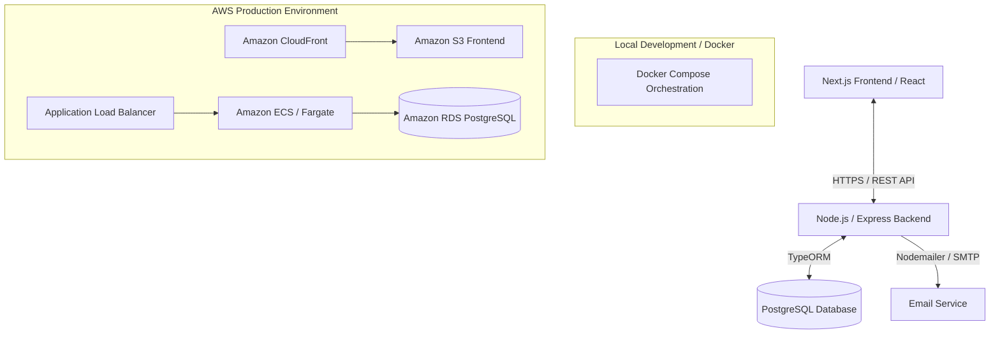

# 💻 Full-Stack Personal Portfolio

A professional, production-ready, full-stack personal portfolio application designed to showcase software engineering projects, skills, certifications, and professional achievements. 

Built with a modern web architecture, this project features a containerized multi-tier setup, automated infrastructure provisioning, and robust CI/CD pipelines.

---

## 🚀 Key Features

*   **Dynamic Project Showcase**: Interactive projects dashboard with filtering, tagging, and search capabilities.
*   **Interactive Skills Matrix**: A visual breakdown of technical competencies, categories, and proficiency levels.
*   **Verified Certifications & Credentials**: Display and manage professional certifications with verification links.
*   **Secure Contact & Inquiry System**: Dynamic contact form with spam protection, rate-limiting, and automated email notifications.
*   **Admin Dashboard**: Protected administration panel to create, update, and delete projects, skills, and certifications in real-time.
*   **Responsive & Accessible UI**: Fluid glassmorphism UI with support for system dark/light mode, adhering to WCAG accessibility guidelines.
*   **Infrastructure-as-Code & Cloud Native**: Fully provisioned on AWS using Terraform and containerized via Docker.

---

## 🛠️ Tech Stack & Architecture

### High-Level Architecture



### Technology Breakdown

*   **Frontend**: 
    *   [](https://nextjs.org/)
    *   [](https://reactjs.org/)
    *   [](https://www.typescriptlang.org/)
    *   [](https://tailwindcss.com/)
*   **Backend**:
    *   [](https://nodejs.org/)
    *   [](https://expressjs.com/)
    *   [](https://typeorm.io/)
    *   [](https://www.postgresql.org/)
*   **DevOps & Infrastructure**:
    *   [](https://aws.amazon.com/)
    *   [](https://www.terraform.io/)
    *   [](https://www.docker.com/)
    *   [](https://github.com/features/actions)

---

## 📂 Project Structure

```text
portfolio/
├── .github/                  # CI/CD pipelines
│   └── workflows/
│       ├── frontend-deploy.yml
│       └── backend-deploy.yml
├── backend/                  # REST API server
│   ├── src/
│   │   ├── config/           # Database & server configs
│   │   ├── controllers/      # Route controllers
│   │   ├── entities/         # TypeORM database entities
│   │   ├── middleware/       # Auth, validation, & error handling
│   │   └── index.ts          # Server entry point
│   ├── Dockerfile
│   ├── package.json
│   └── tsconfig.json
├── frontend/                 # Client application (Next.js)
│   ├── src/
│   │   ├── app/              # Next.js App Router (pages & layouts)
│   │   ├── components/       # Reusable React components (UI/Layout)
│   │   ├── hooks/            # Custom hooks
│   │   └── utils/            # Helper utilities
│   ├── Dockerfile
│   ├── package.json
│   └── tailwind.config.ts
├── infrastructure/           # Infrastructure-as-Code
│   ├── main.tf
│   ├── variables.tf
│   └── outputs.tf
├── docker-compose.yml        # Local multi-container orchestration
└── README.md
```

---

## 🛠️ Local Development & Setup

### Prerequisites

Ensure you have the following installed locally:
*   [Node.js](https://nodejs.org/) (v18.x or higher)
*   [Docker](https://www.docker.com/) & [Docker Compose](https://docs.docker.com/compose/)
*   [Terraform](https://www.terraform.io/) (for cloud deployment)

### 1. Clone the Repository

```bash
git clone https://github.com/georgesantanar/portfolio.git
cd portfolio
```

### 2. Environment Configuration

Create `.env` files in both the `frontend` and `backend` directories.

**Backend Configuration (`backend/.env`):**
```env
PORT=5000
NODE_ENV=development
DB_HOST=localhost
DB_PORT=5432
DB_USERNAME=postgres
DB_PASSWORD=your_password
DB_NAME=portfolio_db
JWT_SECRET=your_jwt_secret
SMTP_HOST=smtp.mailtrap.io
SMTP_PORT=2525
SMTP_USER=your_smtp_username
SMTP_PASS=your_smtp_password
CONTACT_EMAIL=george.santana.devops@gmail.com
```

**Frontend Configuration (`frontend/.env.local`):**
```env
NEXT_PUBLIC_API_URL=http://localhost:5000/api
```

### 3. Spin Up Local Services (Docker Compose)

The easiest way to run the entire stack locally, including the PostgreSQL database, is via Docker Compose:

```bash
docker-compose up --build
```

This will start:
*   **Frontend Client**: `http://localhost:3000`
*   **Backend Server**: `http://localhost:5000`
*   **PostgreSQL Database**: `localhost:5432`

---

## 🚢 Deployment & CI/CD

This application is configured for a continuous deployment workflow utilizing AWS and GitHub Actions.

### Infrastructure Provisioning (Terraform)

The cloud environment is provisioned with high availability and security in mind:

1.  Initialize Terraform:
    ```bash
    cd infrastructure
    terraform init
    ```
2.  Plan the infrastructure details:
    ```bash
    terraform plan
    ```
3.  Deploy resources to AWS:
    ```bash
    terraform apply
    ```

### CI/CD Pipelines (GitHub Actions)

*   **Linting & Testing**: Runs automatically on every pull request to `main` and `develop`.
*   **Deployment Pipeline**:
    *   **Frontend**: Built and synced directly to an AWS S3 Bucket, invalidated via Amazon CloudFront CDN.
    *   **Backend**: Built as a Docker image, pushed to AWS ECR (Elastic Container Registry), and deployed to AWS ECS Fargate.

---

## 👤 Author & Contact

*   **Name**: George A. Santana R.
*   **Role**: DevOps & Full Stack Developer
*   **Email**: [georgeasantanar@gmail.com](mailto:georgeasantanar@gmail.com)
*   **GitHub**: [@georgedeveloperj](https://github.com/georgedeveloperj)
*   **LinkedIn**: [George A. Santana R.](https://linkedin.com/in/ghttps://www.linkedin.com/in/georgedeveloperj)

---

## 📄 License

This project is licensed under the MIT License - see the [LICENSE](LICENSE) file for details.
